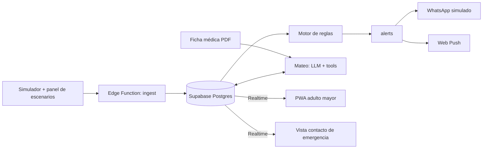

# Acta — Vesta Care

**Fecha:** jueves 1 de octubre de 2026
**Contexto:** Hackatón de 8 horas · demo en vivo + pitch presencial de 3 min
**Equipo:** 3 integrantes (P1 Back/Datos · P2 Front PWA · P3 Agente/IA). *Asignar nombres al inicio.*

---

## 1. Idea

**Vesta Care** es una plataforma para centralizar el monitoreo de salud de adultos mayores que **viven solos o en su casa**. Se descarta la idea anterior (ELEAMs, pulsera y sensores en puertas).

- Cada adulto mayor tiene su propia app (PWA) con toda la información para su cuidado y puede ver si cumple sus objetivos.
- Al centro hay un agente, **Mateo**, que analiza la información, da sugerencias y feedback y envía alertas en caso de peligro.
- La plataforma es **modular**: el usuario conecta los dispositivos según sus condiciones (reloj para presión y ritmo cardíaco, CGM para diabetes, pastillero inteligente, etc.).
- El foco está en la **independencia**: la app debe ser accesible pero no infantilizada. La referencia de UX es **BondUp**, por sus pruebas de usabilidad con personas de 50 a 70 años.

## 2. Decisiones

| Tema | Decisión |
|---|---|
| Usuario | Adulto mayor en su casa (no ELEAM) |
| Plataforma | PWA (Next.js) + Supabase |
| Hardware | Ninguno: todos los dispositivos son simulados |
| Agente | Mateo, con chat, voz y alertas. Multi-proveedor de LLM (se define después según los créditos) |
| Umbrales | Personalizados según la **ficha médica en PDF** que sube el usuario. Mateo los extrae y el usuario los confirma |
| Alertas | Al usuario y a sus contactos de emergencia (agregados por él). Canal: **WhatsApp simulado** + Web Push |
| Vista contacto | Sí: el contacto de emergencia tiene una vista web de solo lectura con el estado de su familiar |
| Preparación previa | No hay: todo se construye durante la hackatón |

## 3. Módulos

**Funcionales (MVP):**

| Módulo | Condición | Métricas | Escenario de alerta (demo) |
|---|---|---|---|
| Pastillero inteligente | Polifarmacia | `dose_taken`, `dose_scheduled` | Dosis omitida por más de 30 min |
| Presión arterial | Hipertensión | `systolic`, `diastolic` (mmHg) | 185/115 → crisis hipertensiva |
| Frecuencia cardíaca | Riesgo cardíaco | `bpm` | Menos de 45 o más de 130 en reposo |
| Glucosa (CGM) | Diabetes | `mg_dl` | Menos de 70 → hipoglucemia |

**Propuestos (maqueta, no 100% funcionales):** detección de caídas · SpO₂ · actividad física · botón SOS.

### Contrato de módulo

```ts
type ModuleManifest = {
  id: string;                      // 'pillbox' | 'bp' | 'heart_rate' | 'glucose'
  name: string;
  conditions: string[];
  status: 'active' | 'proposed';
  metrics: { key: string; unit: string; label: string }[];
  expectedFrequency: string;
  defaultThresholds: Record<string, { warn?: [number, number]; critical?: [number, number] }>;
  goals: string[];
  agentContext: string;            // qué significa cada valor para Mateo
};
```

Agregar un módulo = escribir un manifiesto + un generador en el simulador. El núcleo no se toca.

## 4. Arquitectura



**Regla fija:** las alertas críticas las dispara el **motor de reglas determinista**, no el LLM. Mateo explica, sugiere y redacta.

## 5. Base de datos (Supabase)

```sql
profiles            (id uuid pk -> auth.users, full_name, birth_date, phone)
emergency_contacts  (id, user_id, name, relation, phone, access_token uuid)  -- token = acceso a vista contacto
medical_records     (id, user_id, file_path, extracted jsonb, confirmed bool, created_at)
conditions          (id, user_id, name, source 'ficha'|'manual')
medications         (id, user_id, name, dose, schedule jsonb)
modules             (id text pk, manifest jsonb)
user_modules        (user_id, module_id, enabled bool, thresholds jsonb)
readings            (id, user_id, module_id, metric, value numeric, unit, ts, source)
alerts              (id, user_id, reading_id, level 'warn'|'critical', message, ack bool, ts)
outbound_messages   (id, alert_id, contact_id, channel 'whatsapp_sim', body, ts)
goals               (id, user_id, module_id, description, target jsonb)
chat_messages       (id, user_id, role, content, ts)
```

- RLS por `user_id`. La vista de contacto accede por `access_token` (ruta `/c/[token]`).
- Realtime activo en `readings`, `alerts` y `outbound_messages`.
- Las fichas se guardan en Storage (bucket `medical-records`).

## 6. Mateo (agente)

- **Capa LLM:** Vercel AI SDK, con el proveedor intercambiable por configuración.
- **Tools:** `get_readings`, `get_adherence`, `get_thresholds`, `get_goals`, `explain_alert`, `notify_contacts`, `extract_medical_record`.
- **Voz:** Web Speech API (STT + TTS en el navegador).
- **Flujos:**
  1. **Ficha PDF:** se extrae el texto, Mateo devuelve un JSON (condiciones, medicamentos, umbrales), el usuario confirma y se activan los módulos sugeridos.
  2. **Chat y voz:** preguntas sobre su estado y objetivos.
  3. **Explicación de alertas** en lenguaje simple, con indicaciones de qué hacer.
  4. **Resumen diario** y feedback de adherencia.
- **Límites:** no diagnostica, no modifica dosis y siempre deriva a un profesional o a emergencias (131).

## 7. Alertas: flujo

1. Llega una lectura a `ingest`.
2. El motor de reglas la compara con los umbrales de `user_modules`.
3. Si supera un umbral, se inserta un registro en `alerts`.
4. Si la alerta es **crítica**:
   - Se crea un registro en `outbound_messages` por cada contacto.
   - El **simulador de WhatsApp** (ruta `/demo/whatsapp`, con UI de chat de mensajería) muestra los mensajes en tiempo real.
   - Se envía un Web Push al usuario.
5. La pantalla de alerta en la PWA muestra la explicación de Mateo y los botones "Estoy bien" y "Llamar".

## 8. Plan de trabajo (8 h)

| Hora | P1 — Back/Datos | P2 — Front PWA | P3 — Mateo/IA |
|---|---|---|---|
| 0–1 | Proyecto Supabase, esquema SQL, RLS, seed de "Don Luis" | Setup de Next + PWA (manifest, service worker), design tokens estilo BondUp | Setup de AI SDK, prompt del sistema de Mateo, PDF de ficha ficticia |
| 1–3 | Simulador + Edge Function `ingest` | Onboarding, catálogo de módulos, dashboard | Extracción de la ficha PDF a JSON + pantalla de confirmación |
| 3–5 | Motor de reglas, `alerts`, `outbound_messages`, Web Push | Vistas por módulo con gráficos, contactos de emergencia | Tools + chat con streaming |
| 5–6 | Panel de escenarios + simulador de WhatsApp | Pantalla de alerta, vista contacto `/c/[token]` | Voz (STT/TTS), resumen diario |
| 6–7 | Integración y bugs | Maquetas de módulos propuestos, pulido | Ajuste de prompts, integración |
| 7–8 | **Todos: ensayo de demo + pitch** | | |

**Checkpoints:** h3 (datos fluyendo end-to-end) · h5 (alerta crítica completa) · h7 (congelar features).

## 9. Demo + pitch (3 min)

1. **Problema (30 s):** muchos adultos mayores viven solos, con condiciones crónicas y datos de salud dispersos.
2. **Solución (30 s):** Vesta Care, una plataforma modular, con Mateo como acompañante que promueve la independencia.
3. **Demo en vivo (90 s):**
   - Don Luis sube su ficha y Mateo activa los módulos de presión, glucosa y pastillero.
   - En el panel de escenarios se dispara una crisis de presión.
   - La alerta aparece en la PWA y el WhatsApp simulado del hijo recibe el mensaje.
   - El hijo abre su vista de contacto.
   - Don Luis le pregunta por voz a Mateo "¿qué hago?".
4. **Cierre (30 s):** módulos futuros (caídas, SpO₂, SOS), modelo de negocio (B2C, isapres, cajas de compensación) y privacidad de datos de salud (Ley 21.719).

**Paciente demo:** Don Luis, 78 años, hipertenso y diabético tipo 2, vive solo. Su contacto de emergencia es su hijo.

## 10. Pendientes

- [ ] Asignar P1, P2 y P3 a cada integrante
- [ ] Definir proveedor de LLM y créditos
- [ ] Redactar el PDF de la ficha médica ficticia de Don Luis
- [ ] Definir quién presenta el pitch y quién opera la demo
